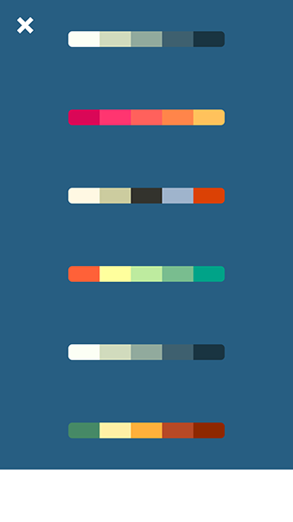

# Colo

[](https://travis-ci.org/wongzigii/Colo) 

Colo is an app helps you to discover color themes from [Adobe Color CC](https://color.adobe.com/explore/newest/?time=all). Colo's data source is based on `libxml2` library to parse content from website. 

## Screenshots
    

## Frameworks
- libxml2.dylib
- UIKit.framework
- CoreData.framework
- Foundation.framework
- SystemConfiguration.framework

## Dependencies
- [Hpple](https://github.com/topfunky/hpple)
- [Reachability](https://github.com/tonymillion/Reachability)
- [PNChart](https://github.com/kevinzhow/PNChart)
- [MBProgressHUD](https://github.com/jdg/MBProgressHUD)
- [SWTableViewCell](https://github.com/CEWendel/SWTableViewCell)

## Getting Start
``` sh
$ git clone https://github.com/wongzigii/Colo.git
$ cd Colo
$ pod install
$ open -a xcode Colo.xcworkspace
```

## Trouble Shooting

    Unresolved error Error Domain=NSCocoaErrorDomain Code=134100 "The operation couldn’t be completed. (Cocoa error 134100.)" 

Delete application entirely within the iOS simulator and rebuild.
    
    Error : Error Domain=NSURLErrorDomain Code=-1005 "The network connection was lost."

Restart the iOS simulator and rebuild.
Refer to this issue : [https://github.com/AFNetworking/AFNetworking/issues/2314](https://github.com/AFNetworking/AFNetworking/issues/2314)

## Todos
- More Features
- CoreData Support

## Gesture Guide
- Double tapping the bottom bar to choose a specific collection according a country.
- Show Cell's UtilityButtons on swipe.

## Design+Code
wongzigii@outlook.com

## Contributing
Please feel free to help out with this project! If you see something that could be made better or want a new feature, open up an issue or send a Pull Request!

## License
Colo is under Apache License 2.0, see the [LICENCE](./LICENSE) file for more info.
