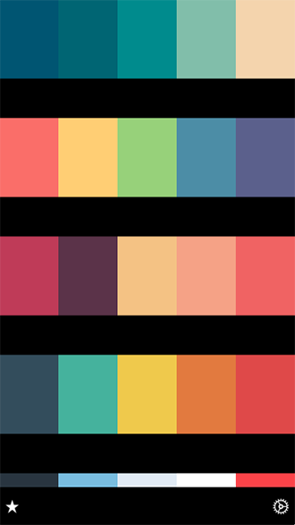
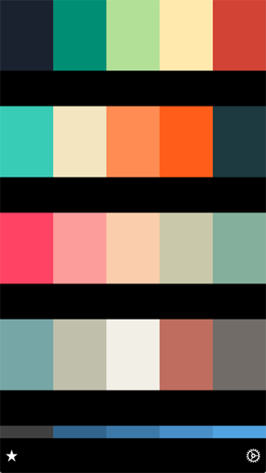

# Colo

 

Colo is an app help you to discover color themes from [Adobe Color CC](https://color.adobe.com/explore/newest/?time=all). Colo's data source is based on `libxml2` library to parse content from website. 

## Disclaimer
Adobe is a trademark of Adobe. Inc. This app is not created nor endorsed by Adobe Inc. All the infomation and content accessible through Colo are subject to Adobe's copyright and terms of use. This is a free app and does not charge for anything. All content are available for free from Adobe Color CC.

## Screenshoots
    

## Frameworks
- libxml2.dylib
- UIKit.framework
- CoreData.framework
- Foundation.framework
- SystemConfiguration.framework

## Dependencies
- [Hpple](https://github.com/topfunky/hpple)
- [Reachability](https://github.com/tonymillion/Reachability)
- [PNChart](https://github.com/kevinzhow/PNChart)

## Trouble Shooting

    Unresolved error Error Domain=NSCocoaErrorDomain Code=134100 "The operation couldn’t be completed. (Cocoa error 134100.)" 

Delete application entirely within the iOS simulator and rebuild.
    
    Error : Error Domain=NSURLErrorDomain Code=-1005 "The network connection was lost."

Restart the iOS simulator and rebuild.
Refer to this issue : [https://github.com/AFNetworking/AFNetworking/issues/2314](https://github.com/AFNetworking/AFNetworking/issues/2314)

## Todos
- More Features
- CoreData Support
- Favourite Collection

## Gesture Guide
- Double tapping the bottom bar to choose a specific collection according a country.

## Design+Code
wongzigii@outlook.com

## Contributing
Please feel free to help out with this project! If you see something that could be made better or want a new feature, open up an issue or send a Pull Request!

## License
Colo is under Apache License 2.0, see the [LICENCE](./LICENSE) file for more info.
